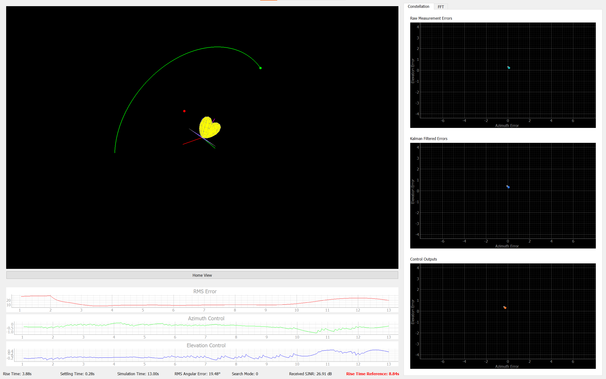

# RF-Based Antenna Tracking System – Simulation Environment

This repository contains a **Python-based simulation framework and visualizer** for the RF-Based Antenna Tracking System (RFATS). The goal of this project is to **evaluate and tune system performance in realistic conditions** (e.g., noise, jamming, attenuation) **without relying on costly and time-consuming physical tests** as a prior assesment.

## Overview

- **Purpose:**  
  To model and assess the closed-loop behavior of the antenna tracking system—including signal reception, direction estimation, control logic, and actuation—in a fully simulated environment.

- **Key Features:**  
  - Simulates RF target movement and received signal strengths for a 4-antenna array.  
  - Models jamming source and signals.  
  - Includes Kalman filtering and PID controllers for direction estimation and tracking.  
  - Provides a **3D visualizer and real-time plots** to analyze system response.  
  - Enables rapid testing of different controller gains and hardware configurations.  

## Requirements

- GNU Radio based radioconda python interpreter (python 3.x)
- Dependencies listed in `requirements.txt`  

